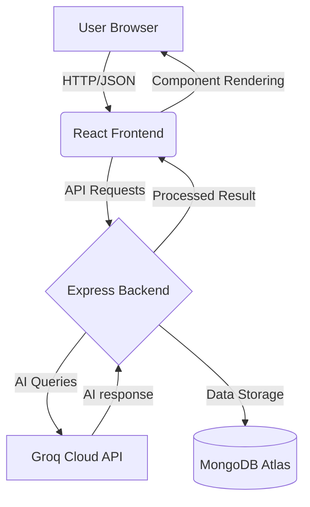

# AI Chat Bot - Frontend 🎨

This is the React frontend for the AI-Chart-BOT, featuring a premium ChatGPT-style interface with a focus on UX and performance.

## 📊 System Architecture



## 🚀 Key Frontend Features

- **Character-by-Character Typing animation**: Ultra-smooth GPT-style response rendering.
- **Theme Support**: Seamless Dark and Light modes with persistent state.
- **Sidebar Navigation**: Desktop toggle and mobile drawer for session history.
- **Auto-Scrolling**: Keeps you engaged with the latest AI responses.
- **Responsive Design**: Built with Tailwind CSS 4 for all screen sizes.

## 🛠️ Tech Stack

- **React 19**
- **Vite** (Build Tool)
- **Tailwind CSS 4**
- **Lucide React** (Icons)
- **Axios** (API Requests)

## ⚙️ Development

1. **Install dependencies**:
   ```bash
   npm install
   ```

2. **Configure Backend URL**:
   Ensure `vite.config.js` or your API service points to the correct backend endpoint.

3. **Start Development Server**:
   ```bash
   npm run dev
   ```

## 📦 Deployment (Vercel/Netlify)

1. Connect this repository to your hosting service.
2. Build command: `npm run build`
3. Output directory: `dist`

---
Part of the **MERN AI Chatbot** suite 🚀
